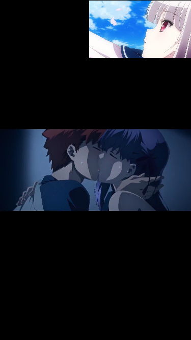

# video-js-demo

video js 样例代码，其中有

### 效果图


### 特性
- 基于vue-cli@3工具生成
- 支持hls直播

### 用到相关的库
- "resize-detector": "^0.2.0",
- "vue-video-player": "5.0.2", （vue-video-player依赖的库如下，具体可以参考node_modules\vue-video-player）
  - "video.js": "^6.6.0",
  - "videojs-contrib-hls": "^5.12.2",
  -  "videojs-flash": "^2.1.0",
  - "videojs-hotkeys": "^0.2.20"

### 文档参考
- 【videojs】https://github.com/videojs/video.js
- 【videojs参数相关】https://docs.videojs.com/tutorial-options.html
- 【vue-video-player】https://github.com/surmon-china/vue-video-player
- 【vue-video-player 例子】https://github.surmon.me/vue-video-player/
- 【直播RTMP服务器相关】 https://qjzd.net/topic/5e3bcf0bdcf06d6a181ffb7f

### Demo代码相关
`src\views\Home.vue`文件中的`/hls/test.m3u8`是直播的地址，根据实际情况修改，另外这个地址是通过最终代理访问的，代理的配置在`vue.config.js`文件中`proxy`配置，也请根据实际情况修改。

## 开始
```
npm install
```

### 开发
```
npm run serve
```

### 编译
```
npm run build
```

### 代码校验
```
npm run lint
```

### Customize configuration
See [Configuration Reference](https://cli.vuejs.org/config/).
